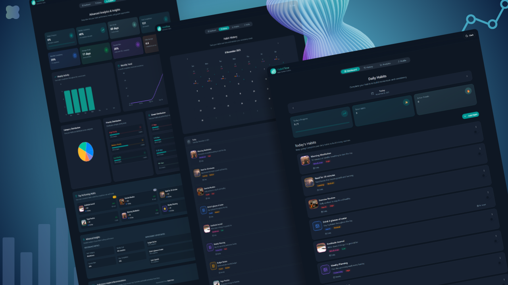

<h1 align="center">🌟 HabitFlow - Modern Habit Tracking Application</h1>

<p align="center">
  <em>A beautiful, powerful, and modern habit tracking app to help you stay consistent, analyze progress, and build better habits.</em>
</p>

<p align="center">
  
  
  
  
  
</p>

---

## ✨ Overview

**HabitFlow** is a modern and feature-rich habit tracking app built with **React**, **TypeScript**, and **TanStack Start**.
It helps you **build consistent habits**, **analyze progress**, and **track achievements** with a clean, minimal interface — fully server-rendered for a fast first load.

---

## 📸 Preview



---

## 🛠️ Tech Stack

| Category              | Tools & Libraries                                              |
| ---------------------- | ---------------------------------------------------------------- |
| **Core**               | React 19.2, TypeScript, TanStack Start (SSR), Vite 8             |
| **Routing**            | TanStack Router — file-based routes under `src/routes/`          |
| **UI**                 | Tailwind CSS v4, shadcn/ui, Radix UI, Lucide Icons                |
| **State & Forms**      | React Hook Form, Zod, @hookform/resolvers, TanStack Query         |
| **Charts**             | Recharts (Bar, Line, Pie charts)                                  |
| **Authentication**     | Firebase Authentication (Email/Password, Google, GitHub)          |
| **Data Storage**       | Local Storage (per-device, with a guest/offline mode by default)  |
| **Animations**         | Motion (Framer Motion)                                            |
| **Deployment**         | Vercel                                                             |

---

## 📁 Folder Structure

```md
HabitFlow/
├── src/
│   ├── routes/           # TanStack Start file-based routes (layouts, pages, root shell)
│   ├── _auth/forms/        # Sign in / sign up form
│   ├── _root/pages/          # Home, History, Analytics, Profile page components
│   ├── components/
│   │   ├── shared/             # App-specific components (HabitCard, Topbar, dialogs...)
│   │   └── ui/                  # shadcn/ui primitives
│   ├── context/                   # HabitsContext (shared habits state)
│   ├── hooks/                       # Custom hooks
│   ├── lib/                           # Firebase config, auth, guest id, date/streak utils
│   ├── services/                        # dataService — local storage persistence layer
│   ├── theme/                             # Dark/light theme provider
│   ├── styles.css                           # Tailwind v4 entry point
│   ├── styles/                                # Extra utility & animation CSS
│   ├── router.tsx, server.ts, start.ts          # TanStack Start entry points
│   └── types/                                     # Shared TypeScript types
├── vite.config.ts
└── package.json
```

---

## 🎯 Core Features

| Feature                    | Description                                                                                                                      |
| -------------------------- | ---------------------------------------------------------------------------------------------------------------------------------- |
| 🔐 **Authentication**      | - Sign in with Email/Password, Google, or GitHub (Firebase Auth) <br> - Guest mode — start tracking right away, no account needed   |
| 🧠 **Habit Management**    | - Create, edit, and delete habits <br> - Progress bars & color-coded categories <br> - Custom reminders, priorities, and tags        |
| 📅 **Calendar & History**  | - Interactive calendar with streak tracking <br> - Visual daily completion insights                                                 |
| 📊 **Analytics Dashboard** | - Visual reports with **Recharts** <br> - Category trends, streaks, and success rates                                               |
| 👤 **Profile**             | - Custom avatar & bio <br> - Editable personal data                                                                                 |

---

## 🎨 Design System

| Feature                  | Description                        |
| ------------------------- | ------------------------------------ |
| 🌗 **Dark/Light Mode**    | Flash-free theme switching on load   |
| ♿ **Accessible UI**      | Built using Radix primitives         |
| 📱 **Responsive Design**  | Optimized for all devices            |
| ✨ **Smooth Animations**  | Motion + Tailwind transitions        |

---

## 🔒 Security & Data

| Feature                 | Details                                                              |
| ------------------------ | ---------------------------------------------------------------------- |
| 🔐 **Authentication**    | Firebase Authentication (Email/Password, Google, GitHub)               |
| 📝 **Validation**        | Zod-based form validation                                               |
| 🛡 **Protected Routes**   | Auth-aware routing                                                       |
| 💾 **Habit Data**        | Stored locally on your device (not synced to a server yet — see Roadmap) |

---

## 🚀 Quick Start

```bash
git clone https://github.com/Maher-Elmair/HabitFlow.git
cd HabitFlow
npm install
```

Create a `.env.local` file in the project root with your Firebase project credentials:

```env
VITE_FIREBASE_API_KEY=
VITE_FIREBASE_AUTH_DOMAIN=
VITE_FIREBASE_PROJECT_ID=
VITE_FIREBASE_STORAGE_BUCKET=
VITE_FIREBASE_MESSAGING_SENDER_ID=
VITE_FIREBASE_APP_ID=
VITE_FIREBASE_MEASUREMENT_ID=
```

Then run:

```bash
npm run dev
```

---

## 📈 Roadmap

| Upcoming Feature                  | Status / Notes                                                           |
| ----------------------------------- | ---------------------------------------------------------------------------- |
| ☁️ **Cloud data storage**           | Move habit data from Local Storage to a cloud database (Firestore)           |
| 📱 **Multi-device access**          | Sign in from your phone, laptop, or any other device and see your habits there |
| 🔄 **Real-time sync**               | Changes made on one device (completions, streaks, edits) appear instantly on your other devices |
| 🔔 Push notifications               | Habit reminders                                                              |
| 🤝 Habit challenges & sharing       | Social features                                                              |

---

### 👨‍💻 Author

**Maher Elmair**

- 📫 [maher.elmair.dev@gmail.com](mailto:maher.elmair.dev@gmail.com)
- 🔗 [LinkedIn](https://www.linkedin.com/in/maher-elmair)
- ✖️ [X (Twitter)](https://x.com/Maher_Elmair)
- ❤️ Made with passion by [Maher Elmair](https://maher-elmair.github.io/My_Website)

---

## 🌐 Live Demo

🚀 **Try it now on Vercel:**
👉 [habitflow.vercel.app](https://habit-flow-gold.vercel.app/)

---

## 🙌 Thank You

If you found HabitFlow useful or helped you build better habits, please consider giving it a ⭐️  
Issues, pull requests, and suggestions are always welcome 🙏

---

<h6 align="center"><i>HabitFlow — Built to help you build better habits, one day at a time</i></h6>